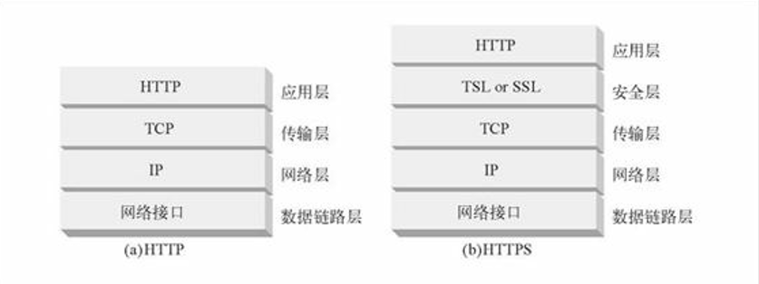
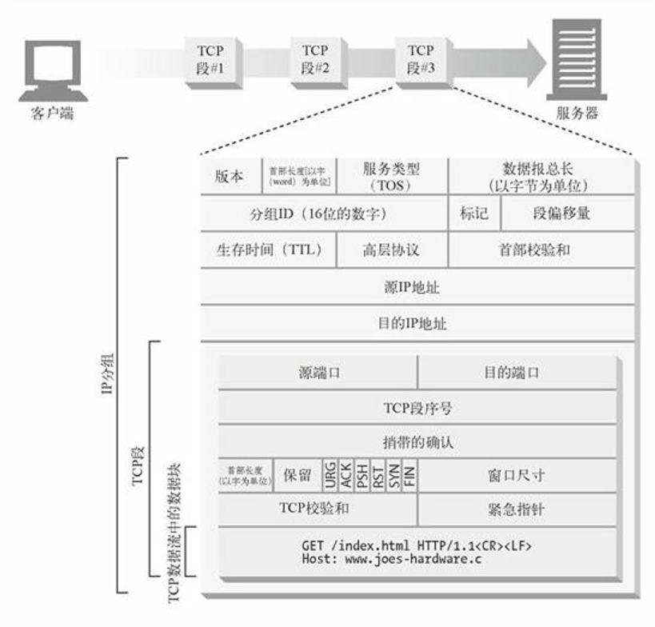

### TCP连接  
世界上几乎所有的HTTP通信都是由TCP/IP承载的，TCP/IP是全球计算机及网络设备都在使用的一种常用的*分组交换网络协议集*。客户端应用程序可以打开一条TCP/IP连接，连接到可能运行在世界上任何地方的服务器应用程序。一旦连接建立起来，在客户端和服务器的计算机之间交换的报文就永远不会丢失、受损或失序。  
#### TCP的可靠数据管道  
HTTP实际上就是TCP连接及其使用规则。TCP连接是因特网上的可靠连接。  
TCP为HTTP提供了一条可靠的比特传输管道。从TCP连接一段填入的字节会从另一端以原有的顺序、正确地传送出来。  
#### TCP流是分段的、由IP分组传送  
TCP的数据是通过名为IP分组（或IP数据报）的小数据块来发送的。  
HTTP就是 "HTTP over TCP over IP" 这个 "协议栈" 中的最顶层了。其安全版本HTTPS就是在HTTP和TCP之间插入了一个（称为TLS或SSL的）密码加密层。  
  
HTTP要传送一条报文时，会以流的形式将报文数据的内容通过一条打开的TCP连接按序传输。TCP收到数据流之后，会将数据流砍成被称作段的小数据块，并将段封装在IP分组中，通过因特网进行传输。  

