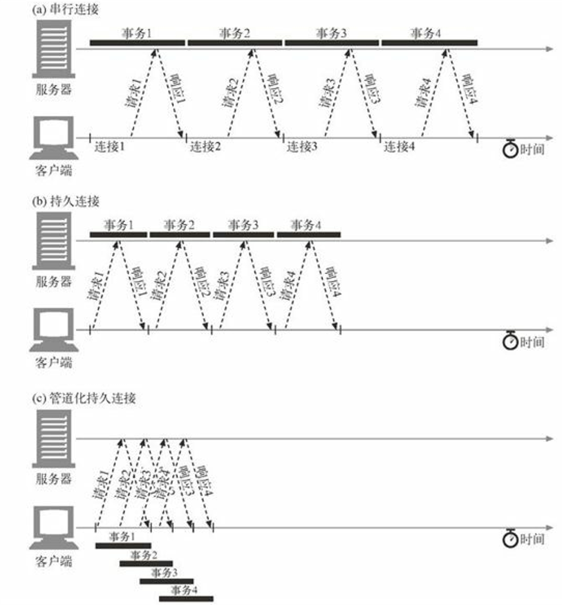

### TCP连接  
世界上几乎所有的HTTP通信都是由TCP/IP承载的，TCP/IP是全球计算机及网络设备都在使用的一种常用的*分组交换网络协议集*。客户端应用程序可以打开一条TCP/IP连接，连接到可能运行在世界上任何地方的服务器应用程序。一旦连接建立起来，在客户端和服务器的计算机之间交换的报文就永远不会丢失、受损或失序。  
#### TCP的可靠数据管道  
HTTP实际上就是TCP连接及其使用规则。TCP连接是因特网上的可靠连接。  
TCP为HTTP提供了一条可靠的比特传输管道。从TCP连接一段填入的字节会从另一端以原有的顺序、正确地传送出来。  
#### TCP流是分段的、由IP分组传送  
TCP的数据是通过名为IP分组（或IP数据报）的小数据块来发送的。  
HTTP就是 "HTTP over TCP over IP" 这个 "协议栈" 中的最顶层了。其安全版本HTTPS就是在HTTP和TCP之间插入了一个（称为TLS或SSL的）密码加密层。  
  
HTTP要传送一条报文时，会以流的形式将报文数据的内容通过一条打开的TCP连接按序传输。TCP收到数据流之后，会将数据流砍成被称作段的小数据块，并将段封装在IP分组中，通过因特网进行传输。  

每个TCP段都是由IP分组承载，从一个IP地址发送到另一个IP地址。每个IP分组中都包括：  
* 一个IP分组首部（通常为20字节）；  
* 一个TCP段首部（通常为20字节）；  
* 一个TCP数据块（0个或多个字节）。  
IP首部包含了源和目的IP地址、长度和其他一些标记。TCP段的首部包含了TCP端口号、TCP控制标记，以及用于数据排序和完整性检查的一些数字值。  

#### 保持TCP连接的持续不间断运行  
在任意时刻计算机都可以有几条TCP连接处于打开状态。TCP是通过端口号来保持所有这些连接持续不断地运行。  
端口号和雇员使用的电话分机很类似。就像公司的踪迹号码能将你接到前台，而分机号可以将几接到正确的雇员位置一样，IP地址可以将你连接到正确的计算机，而端口号则可以将你连接到正确的应用程序上午。TCP连接时通过4个值来识别的：`源IP地址`、`源端口号`、`目的IP地址`、`目的端口号`   
这4个值一起唯一地定义了一条连接。两条不同的TCP连接不能拥有4个完全相同的地址组件值（但不同连接的部分组件可以拥有相同的值）。  
#### 使用TCP套接字编程  
操作系统提供了一些操纵其TCP连接的工具。套接字API最初是为Unix操作系统开发的，但现在几乎所有的操作系统和语言中都有其变体存在。  

套接字API调用                       | 描述    
-----------------------------------| --------------
`s = socket(<parameters>)`         | 创建一个新的、未命名、未关联的套接字  
`bind(s,<local IP:port>)`          | 向套接字赋一个本地端口号和接口  
`connect(s, <remote IP:port>)`     | 创建一条连接本地套接字和远程主机及端口的连接  
`listen(s, ...)`                   | 表示一个本地套接字，使其可以合法接受连接  
`s2 = accept(s)`                   | 等待某人建立一条到本地端口的连接  
`n = read(s, buffer, n)`           | 尝试从套接字向缓冲区读取*n*个字节  
`n = write(s, buffer, n)`          | 尝试从缓冲区中向套接字写入*n*个字节  
`close(s)`                         | 完全关闭TCP连接  
`shutdown(s, <side>)`              | 只关闭TCP连接的输入或输出端  
`getsockopt(s, ...)`               | 读取某个内部套接字配置选项的值  
`setsockopt(s, ...)`               | 修改某个内部套接字配置选项的值  

套接字API允许用户创建TCP的端点数据结构，将这些端点与远程服务器的TCP端点进行连接，并对数据流进行读写。TCP API隐藏了所有底层网络协议的握手细节，以及TCP数据流与IP分组之间的分段和重装细节。  

### 对TCP性能的考虑  
HTTP紧挨着TCP，位于其上层，所以HTTP事务的性能在很大程度上取决于底层TCP通道的性能。  
#### HTTP事务的时延  
与建立TCP连接，以及传输请求和响应报文的时间相比，事务处理的时间可能是很短的。除非客户端或服务器超载，或正在处理复杂的动态资源，否则HTTP时延就是由TCP的网络时延构成的。  
HTTP事务的时延有以下几种主要原因。  
（1）客户端首先需要根据URI确定Web服务器的IP地址和端口号。如果最近没有对URI中的主机名进行访问，通过DNS解析系统将URI中的主机名转换成一个IP地址可能要花费数十秒的时间。  
（2）接下来，客户端会向服务器发送一条TCP连接请求，并等待服务器回送一个请求接收应答。每条新的TCP连接都会有连接建立时延。这个值通常最多只有一两秒钟，但如果有数百个HTTP事务的话，这个值会很快速地叠加上去。  
（3）一旦连接建立起来了，客户端就会通过新建立的TCP管道来发送HTTP请求。数据到达时，Web服务器会从TCP连接中读取请求报文，并对请求进行处理。因特网传输请求报文，以及服务器处理请求报文都需要时间。 
（4）然后，Web服务器会回送HTTP响应，这也需要花费时间。  
这些TCP网络时延的大小取决于硬件速度、网络和服务器的负载，请求和响应报文的尺寸，以及客户端和服务器之间的距离。TCP协议的结束复杂性也会对时延产生巨大的影响。  
#### 性能聚焦区域  
一些会对HTTP程序员产生影响的、最IC行家爱你的TCP相关时延，其中包括：  
* TCP连接建立握手；  
* TCP慢启动拥塞控制；  
* 数据聚焦的Nagle算法；  
* 用于捎带确认的TCP延迟确认算法；  
* TIME_WAIT时延和端口耗尽。  
#### TCP连接的握手时延  
建立一条新的TCP连接时，甚至是在发送任意数据之前，TCP软件之间会交换一些列的IP分组，对连接的有关参数进行沟通。如果连接只用来传送少量数据，这些交换过程就会严重降低HTTP的性能。  
TCP连接握手需要经过以下几个步骤。  
（1）请求新的TCP连接时，客户端要向服务器发送一个小的TCP分组（通常是40~60个字节）。这个分组中设置了一个特殊的SYN标记，说明这是一个连接请求。  
（2）如果服务器接收了连接。就会对一些连接参数进行计算，并向客户端回送一个TCP分组，这个分组中的SYN和ACK变价都被置位，说明连接请求已被接受。  
（3）最后，客户端向服务器回送一条确认信息，通知它连接已经成功建立。现代的TCP栈都允许客户端在这个确认分组中发送数据。  
HTTP程序员永远看不到这些分组——这些分组都由TCP/IP软件管理，对其实不可见的。HTTP程序员看到的只是创建TCP连接时存在的时延。  
通常HTTP事务都不会交换太多数据，此时，SYN/SYN+ACK握手会产生一个可测量的时延。TCP连接的ACK分组通常都足够大，可以承载整个HTTP请求报文，而且很多HTTP服务器响应报文都可以放入一个IP分组中去（比如，响应时包好了装饰性图片的小型HTML文件，或者是对浏览器告诉缓存请求产生的304 Not Modified响应）。  
最后的结果是，小的HTTP事务可能会在TCP建立上花费50%，或更多的时间。  
#### 延迟确认  
由于因特网自身无法确保可靠的分组传输（因特网路由器超负荷的话，可以随意丢弃分组），所以TCP实现了自己的确认机制来确保数据的成功传输。  
每个TCP段都有一个序列号和数据完整性校验和。每个段的接受者收到完好的段时，都会向发送者回送小的确认分组。如果发送者没有在指定的窗口时间内收到确认信息，发送者就会认为分组已经被破坏或损毁，并重发数据。  
由于确认报文很小，所以TCP允许在发往相同方向的输出数据分组中对其进行"捎带"。TCP将返回的确认信息与输出的数据分组结合在一起，可以更有效地利用网络。为了增加确认报文找到同向传输数据分组的可能性，很多TCP栈都实现了一种"延迟确认"算法。延迟确认算法会在一个特定的窗口时间（通常是100~200毫秒）内将输出确认存在缓冲区中，以寻找能到捎带它的输出数据分组。如果在哪个时间段内没有输出数据分组，就将确认信息放在单独的分组中传送。  
但是，HTTP具有双峰特征的请求-应答行为降低了捎带信息的可能。当希望有相反方向回传分组的时候，偏偏没有那么多。通常，延迟确认算法会引入相当大的时延。根据所使用操作系统的不同，可以调整或禁止延迟确认算法。  
在对TCP栈的任何参数进行修改之前，一定要对自己在做什么有清醒的认识。TCP中引入这些算法的目的是防止设计欠佳的应用程序对因特网造成破坏。对TCP配置进行的任意修改，都要绝对确保应用程序不会引发这些算法所要避免的问题。  
#### TCP慢启动  
TCP数据传输的性能还取决于TCP连接的试用期（age）。TCP连接会随着时间进行自我“调谐”，起初会限制连接的最大速度，如果数据成功传输，会随着时间的推移提高传输的速度。这种调谐被称为TCP慢启动（slow start），用于防止因特网的突然过载和拥塞。  
TCP慢启动限制了一个TCP端点在任意时刻可以传输的分组数。简单来说，每成功接收一个分组，发送端就有了发送另外两个分组的权限。如果某个HTTP事务有大量数据要发送，是不能一次将所有分组都发送出去的。必须发送一个分组，等待确认；然后可以发送两个分组，每个分组都必须被确认，这样就可以发送四个分组了，以此类推。这种方式被称为“打开拥塞窗口”。  
用于存在这种拥塞控制特性，所以新连接的传输速度会比已经交换过一定量数据的、“已调谐”连接慢一些。由于已调谐连接要更快一些，所以HTTP中有一些可以重用现存连接的工具。  
#### Nagle算法与TCP_NODELAY  

#### TIME_WAIT累积与端口耗尽  
TIME_WAIT端口耗尽是很严重的性能问题，会影响到性能基准，但在现实中相对较少出现。大多数遇到性能基准问题的人最终都会碰到这个问题，而且性能都会变得出乎意料的差。  
当某个TCP端点关闭TCP连接时，会在内存中维护一个小的控制块，用来记录最近所关闭连接的IP地址和端口号。这类信息只会维持一小段时间，通常是所顾忌的最大分段使用期的两倍（称为2MSL,通常为2分钟）左右，以确保在这段时间内不会创建具有相同地址和端口号的新连接。实际上，这个算法可以防止在两分钟内创建、关闭并重新创建两个具有相同IP地址和端口号的连接。  
现在高速路路由器的使用，使得重复分组几乎不可能在连接关闭的几分钟之后，出现在服务器上。有些操作系统会将2MSL设置为一个较小的值，但修改此值时要特别小心。分组确实会被复制，如果来自之前连接的复制分组插入了具有相同连接值的新TCP流，会破坏TCP数据。  
2MSL的里阿尼额关闭延迟通常不是什么问题，但在性能基准环境下就可能会成为一个问题。进行性能基准测试时，通常只有一台或几台用来产生流量的计算机连接到某系统中去，这样就限制了连接到服务器的客户端IP地址树。而且，服务器通常会在HTTP的默认TCP端口80上进行监听。用TIME_WAIT防止端口号重用时，这些情况也限制了可用的连接值组合。  
在只有一个客户端和一台Web服务器的异常的情况下，构建一条TCP连接的4个值：  
`<source-IP-address, source-port, destination-IP-address, destination-port>`   
其中的3个都是固定的——只有源端口号可以随意改变：  
`<client-IP, source-portm, server-IP, 80>`  
客户端每次连接到服务器上时，都会获得一个新的源端口，以实现连接的唯一性。但由于可用源端口的数量有限（比如， 60000个），而且在2MSL（比如，120秒）内连接时无法重用的，连接率就被限制在了60000/120=500次/秒，就可确保不会遇到TIME_WAIT端口耗尽问题。要修正这个问题，可以增加客户端负载生成机器的数量，或者确保客户端和服务器在循环使用几个虚拟IP地址以增加更多的连接组合。  
即使没有遇到端口耗尽问题，也要特别小心有大量连接处于打开状态的情况，或为处于等待状态的连接分配了大量控制块的情况。在有大量打开连接或控制块的情况下，有些操作系统的速度会严重减缓。  
### HTTP连接的处理  
#### 常被误解的Connection首部  
HTTP允许在客户端和最终的源端服务器之间存在一串HTTP中间实体（代理、告诉缓存等）。可以从客户端开始，逐跳地将HTTP报文经过这些中间设备，转发到源端服务器上去（或者进行反向传输）。  
在某些情况下，两个相邻的HTTP应用程序会为它们共享的连接应用一组选项。HTTP的Connection首部字段中有一个由逗号分隔的连接标签列表，这些标签为此连接指定了一些不会传播到其他连接中去的选项。比如，可以用Connection:close来说明发送完下一条报文之后必须关闭的连接。  
Conneciton首部可以承载3种不同类型的标签，因此有时会很令人费解：  
* HTTP首部字段名，累出了只与此连接有关的首部；  
* 任意标签值，用于描述此连接的非标准选项；  
* 值close，说明操作完成之后需关闭这条持久连接。  
#### 串行事务处理是延  
现存和新兴的提高HTTP连接性能的方法：  
* 并行连接  
>通过多条TCP连接发起并发的HTTP请求。  
* 持久连接  
>重用TCP连接，以消除连接及关闭时延。  
* 管道化连接  
>通过共享的TCP连接发起并发的HTTP请求。  
* 复用的连接  
>交替传送请求和响应报文（实验阶段）。  

### 并行连接  
#### 并行连接可能会提高页面的加载速度  
包含嵌入对象的组合页面如果能（通过并行连接）克服单条连接的空载时间和带宽限制，加载速度也会有所提高。时延可以重叠起来，而且如果单条连接没有充分利用客户端的因特网带宽，可以将未用带宽分配来装载其他对象。  
#### 并行连接不一定更快  
即使并行连接的速度可能会更快，但并不一定总是更快。客户端的网络带宽不足（比如，浏览器是通过一个28.8kbps的Modem连接到因特网上去的）时，大部分的时间可能都是用来传送数据的。在这种情况下，一个连接到速度较快服务器上的HTTP事务就会很容易地耗尽所有可用的Modem宽度。如果并行加载多个对象，每个对象都会去竞争者有限的带宽，每个对象都会以较慢的速度按比例加载，这样带来的性能提升就很小，甚至没什么提升。  
而且，打开大量连接会消耗很多内存资源，从而引发自身的性能问题。复杂的Web页面可能会有数十或数百个内嵌对象。客户端可能可以打开数百个连接，但Web服务器通常要同时处理很多其他用户的请求，所以很少有web服务器希望出现这样大的情况。一百个用户同时发出申请，每个用户打开100个连接，服务器就要处理10000个连接。这回造成服务器性能的严重下载。对高负荷的代理来说也同样如此。  
实际上，浏览器确实使用了并行连接，但它们会将并行连接的总数限制为一个较小的值（通常是4个）。服务器可以随意关闭来自特定客户端的超量连接。  
### 持久连接  
Web客户端经常会打开到同一个站点的连接。比如，一个Web页面上的大部分内嵌图片通常都来自同一个Web站点，而且相当一部分指向其他对象的超链通常都指向同一个站点。因此，初始化了对某服务器HTTP请求的应用程序很可能会在不久的将来对那台服务器发起更多的请求（比如，获取在线图片）。这种性质被称为站点局部性（site locality）。  
因此，HTTP/1.1（以及HTTP/1.0的各种增强版本）允许HTTP设备在事务处理结束之后将TCP连接保持在打开状态，以便为未来的HTTP请求重用现存的连接。在事务 处理结束之后仍然保持在打开状态的TCP连接被称为持久连接。非持久连接会在每个事务结束之后关闭。持久连接会在不同事务之间保持打开状态，直到客户端或服务器决定将其关闭为止。  
重用已对目标服务器打开的空闲持久连接，就可以避开缓慢的连接建立阶段。而且，已经打开的连接还可以避免慢启动的拥塞适应阶段，以便更快速地进行数据的传输。  
#### 持久以及并行连接  
并行连接可以提高复合页面的传输速度，但并行连接也有一些缺点：  
* 每个事物都会发开/关闭一条新的连接，会耗费时间和宽度。  
* 由于TCP慢启动特性的存在，每条新连接的性能都会有所降低。  
* 可打开的并行连接数量实际上是有限的。  
持久连接有一些比并行连接更好的地方。持久连接降低了时延和连接建立的开销，将连接保持在已调谐状态，而且减少了打开连接的潜在数量。但是，管理持久连接时要特别小心，不然就会积累出大量的空闲连接，耗费本地以及远程客户端和服务器上的资源。  
持久连接与并行连接配合使用可能是最高效的方式。现在，很多Web应用程序都会打开少量的并行连接，其中的每一个都是持久连接。持久连接有两种类型：比较老的HTTP/1.0+ "keep-alive"连接，以及现代的HTTP/1.1 "persistent"连接。  
#### HTTP/1.0+ keep-alive连接  
大约从1996年开始，很多HTTP/1.0浏览器和服务器都进行了扩展，以支持一种被称为keep-alive连接的早期实验型持久连接。这些早期的持久连接受到了一些互操作性设计方面问题的困扰，这些问题在后期的HTTP/1.1版本中都得到了修正，但很多客户端和服务器仍然在使用这些早期的keep-alive连接。  
#### Keep-Alive操作  
keep-alive已经不再使用了，而且在当前的HTTP/1.1规范中也没有对它的说明了。但浏览器和服务器对keep-alive握手的使用仍然相当广泛，因此，HTTP的实现者应该做好与之进行交互操作的准备。  
实现HTTP/1.0 keep-alive连接的客户端可以通过包含Connection: Keep-Alive 首部请求将一条连接保持在打开状态。  
如果服务器愿意为下一条请求将连接保持在打开状态，就在响应中包含相同的首部。如果响应中没有Connection: Keep-Alive首部，客户端就认为服务器不支持keep-alive，会在发回响应报文之后关闭连接。  
#### Keep-Alive选项  
注意，keep-Alive首部只是请求将连接保持在活跃状态。发出keep-alive请求之后，客户端和服务器并不一定会同意进行keep-alive会话。它们可以在任意时刻关闭空闲的keep-alive连接，并可随意限制keep-alive连接所处理事务的数量。  
可以用Keep-Alive通用首部中指定的、由逗号分隔的选项来调节keep-alive的行为。  
* 参数timeout是在Keep-Alive响应首部发送的。它估计了服务器希望将连接保持在活跃状态的时间。这并不是一个承诺值。  
* 参数max是在Keep-Alive响应首部发送的。它估计了服务器还希望为多少个事务保持此连接的活跃状态。这并不是一个承诺值。  
* Keep-Alive首部还可以支持任意未经处理的属性，这些属性主要用于诊断和调试。语法为name[=value]。  
Keep-Alive首部完全是可选的，但只有在提供Connection: Keep-Alive时才能使用它。这里有个Keep-Alive响应首部的例子，这个例子说明服务器最多还会为另外5个事务保持连接的打开状态，或者将打开状态保持到连接空闲了2分钟之后。  
`Connection: Keep-Alive Keep-Alive: max=5, timeout=120`  

#### Keep-Alive连接的限制和规则  
* 在HTTP/1.0中，keep-alive并不是默认使用的。客户端必须发送一个 Connection: Keep-Alive请求首部来激活keep-alive连接。  
* Connection: Keep-Alive首部必须随所有希望保持持久连接的报文一起发送。如果客户端没有发送Connection: Keep-Alive首部，服务器就会在那条请求之后关闭连接。  
* 通过检测响应中是否包含Connection: Keep-Alive响应首部，客户端可以判断服务器是否会在发出响应之后关闭连接。   
* 只有在无需检测到连接的关闭即可确定报文实体主体部分长度的情况下，才能将连接保持在打开状态——也就是说实体的主体部分必须有正确的ContentLength，有多部件媒体类型，或者用分块传输编码的方式进行了编码。在一条keep-alive信道中回送错误的Content-Length是很糟糕的事，这样的话，事务处理的另一端就无法精确地检测出一条报文的结束和另一条报文的开始了。   
* 代理和网关必须执行Connection首部的规则。代理或网关必须在将报文转发出去或将其高速缓存之前，删除在Connection首部中命名的所有首部字段以及Connection首部自身。  
* 严格来说，不应该与无法确定是否支持Connection首部的代理服务器建立keepalive连接，以防止出现下面要介绍的哑代理问题。在实际应用中不是总能做到这一点的。  
* 从技术上来讲，应该忽略所有来自HTTP/1.0设备的Connection首部字段（包括 Connection: Keep-Alive），因为它们可能是由比较老的代理服务器误转发的。 但实际上，尽管可能会有在老代理上挂起的危险，有些客户端和服务器还是会违反这条规则。  
* 除非重复发送请求会产生其他一些副作用，否则如果在客户端收到完整的响应之前连接就关闭了，客户端就一定要做好重试请求的准备。  
#### Keep-Alive和哑代理  
#### HTTP/1.1持久连接  
HTTP/1.1逐渐停止了对keep-alive连接的支持，用一种名为持久连接（persistent connection）的改进型设计取代了它。持久连接的目的与keep-alive连接的目的相同，但工作机制更优一些。  
与HTTP/1.0+的keep-alive连接不同，HTTP/1.1持久连接在默认情况下是激活的。除非特别指明，否则HTTP/1.1假定所有连接都是持久的。要在事务处理结束之后将连接关闭，HTTP/1.1应用程序必须向报文中显示地添加一个Connection:close首部。这是与之前的HTTP协议版本很重要的区别，在以前的版本中，keep-alive连接要么是可选的，要么根本就不支持。  
HTTP/1.1客户端假定在收到响应后，除非响应中包含了Connection: close首部，不然HTTP/1.1连接就仍维持在打开状态。但是，客户端和服务器仍然可以随时关闭空闲的连接。不发送Conneciton：close并不意味着服务器承诺永远将连接保持在打开状态。   
#### 持久连接的限制和规则   
* 发送了Connection: close请求首部之后，客户端就无法在那条连接上发送更多的请求了。  
* 如果客户端不想在连接上发送其他请求了，就应该在最后一条请求中发送一个Connection: close请求首部。  
* 只有当连接上所有的报文都有正确的、自定义报文长度时——也就是说，实体主体部分的长度都和相应的Content-Length一致，或者是用分块传输编码方式编码的——连接才能持久保持。  
* HTTP/1.1的代理必须能够分别管理与客户端和服务器的持久连接——每个持久连接都只适用于一跳传输。 
* （由于较老的代理会转发Connection首部，所以）HTTP/1.1的代理服务器不应该与HTTP/1.0客户端建立持久连接，除非它们了解客户端的处理能力。实际上，这一点是很难做到的，很多厂商都违背了这一原则。  
* 尽管服务器不应该试图在传输报文的过程中关闭连接，而且在关闭连接之前至少应该响应一条请求，但不管Connection首部取了什么值，HTTP/1.1设备都可以在任意时刻关闭连接。  
* HTTP/1.1应用程序必须能够从异步的关闭中恢复出来。只要不存在可能会累积起来的副作用，客户端都应该重试这条请求。  
* 除非重复发起请求会产生副作用，否则如果在客户端收到整条响应之前连接关闭了，客户端就必须要重新发起请求。  
*  一个用户客户端对任何服务器或代理最多只能维护两条持久连接，以防服务器过载。代理可能需要更多到服务器的连接来支持并发用户的通信，所以，如果有N个用户试图访问服务器的话，代理最多要维持2N条到任意服务器或父代理的连接。  
### 管道化连接  
HTTP/1.1允许在持久连接上可选地使用请求管道。这是相对于keep-alive连接的又一性能优化。在响应达到之前，可以将多条请求放入队列。当第一条请求通过网络流向地球另一端的服务器时，第二条和第三条请求也可以开始发送了。在高时延网络条件下，这样可以降低网络的环回时间，提高性能。  

对管道化连接有几条限制。  
* 如果HTTP客户端无法确认连接是持久的，就不应该使用管道。  
* 必须按照与请求相同的顺序回送HTTP响应。HTTP报文中没有序列号标签，因此如果收到的响应失序了，就没办法将其与请求匹配起来了。  
* HTTP客户端必须做好连接会在任意时刻关闭的准备，还要准备好重发所有未完成的管道化请求。如果客户端打开了一条持久连接，并立即发出了10条请求，服务器可能在只处理了，比方说，5条请求之后关闭连接。剩下的5条请求会失败，客户端必须能够应对这些过早关闭连接的情况，重新发出这些请求。  
* HTTP客户端不应该用管道化的方式发送会产生副作用的请求（比如POST）。总之，出错的时候，管道化方式会阻碍客户端了解服务器执行的是一系列管道化请求中的哪一些。由于无法安全地重试POST这样的非幂等请求，所以出错时，就存在某些方法永远不会被执行的风险。  
### 关闭连接的奥秘  
连接管理——尤其是知道在什么时候以及如何去关闭连接————时HTTP的实用魔法之一。  
#### "任意"解除连接  
#### Content-Length及截尾操作  
#### 连接关闭容限、重试以及幂等性  
#### 正常关闭连接   

 

